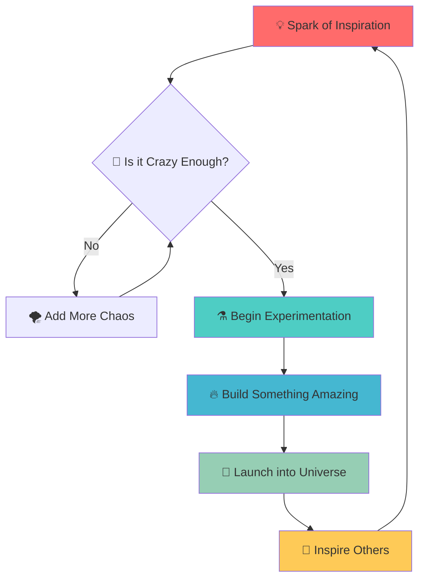

# 🌌 ∞ **COSMIC CODEX** ∞ 🌌

<div align="center">

```
          ✦       •      ·     ✧        ·   •      ✦       ∘      ·     ✧        ·   •      ✦
            ·    ∘   ·         ✧     ·     ✦    ·      ·    ∘   ·         ✧     ·     ✦    ·
        •    ✧      ·    ∘      ·         •        •    ✧      ·    ∘      ·         •
            ·     ·    ✦    ·       ∘   ·            ·     ·    ✦    ·       ∘   ·
          ∘    ·         •    ·    ✧    ·   ∘      ∘    ·         •    ·    ✧    ·   ∘
            ·    ✦   ·         ·     •    ·          ·    ✦   ·         ·     • 
```

</div>

<p align="center">
  
</p>

---

## 🚀 **MISSION STATUS**

<div align="center">

| System | Status | Level |
|--------|--------|-------|
| 🧠 **Creativity Engine** |  | ████████████ 100% |
| ⚡ **Power Levels** |  | ████████████ ∞ |
| 🌟 **Inspiration Flow** |  | ████████████ LIVE |

</div>

---

## 🎭 **WHAT DWELLS IN THE COSMIC VOID?**

<details>
<summary>🔮 <strong>Click to Unveil the Mysteries</strong> ✨</summary>

<br>

```ascii
          ╭─────────────────────────────────────────────────────────────────────────────╮
           │  🌠 This repository exists in a quantum superposition of potential and      │
          │     possibility, waiting to collapse into something extraordinary           │
           │                                                                             │
          │  🎪 It's a playground for wild adventures and creative endeavors:           │
           │     • Wild experiments that push the boundaries of imagination 🧪           │
          │     • Crazy prototypes that defy conventional logic 🛸                     │
           │     • Midnight inspirations born from coffee and starlight 🌙              │
          │     • Digital alchemy that transforms ideas into reality ⚗️                │
           │                                                                             │
          │  ✨ Sometimes the best code comes from the most unexpected places in the    │
           │     universe, when logic meets magic and dreams become algorithms...        │
          ╰─────────────────────────────────────────────────────────────────────────────╯
```

</details>

---

## 🎨 **CREATIVE DIMENSIONS**

<table>
<tr>
<td width="50%">

### 🌈 **Visual Spectrum**
```
██████████ Languages
██████████ Frameworks  
██████████ Dreams
██████████ Coffee
██████████ Music
```

</td>
<td width="50%">

### 🧬 **DNA Structure**
```
A─T  🎵 Melody
G─C  🎨 Color
T─A  💭 Thought  
C─G  ⚡ Energy
A─T  🌟 Magic
```

</td>
</tr>
</table>

---

## 🎪 **THE CREATIVE PROCESS**



---

## 🏆 **ACHIEVEMENTS UNLOCKED**

<div align="center">

[](https://github.com)
[](https://github.com)
[](https://github.com)
[](https://github.com)
[](https://github.com)

</div>

---

## 📊 **REPOSITORY ANALYTICS**

<div align="center">

```
                            🌟 Star Formation Rate: ████▒▒▒ Growing
                            🍴 Fork Probability:    ██▒▒▒▒▒ Possible  
                            👁️ Watchers in Orbit:   ███▒▒▒▒ Observing
                            🐛 Bug Encounters:      ▒▒▒▒▒▒▒ Peaceful
                            ☕ Coffee Consumption:   █████████ Critical
```

</div>

---

## 🛸 **CONTACT THE MOTHERSHIP**

<div align="center">

```
          ╔═════════════════════════════════════════════════════════════════════════╗
           ║                       📡 TRANSMISSION FREQUENCIES                      ║
          ║                                                                         ║
           ║                       🌐 GitHub: Where you found me                     ║
          ║                        💬 Issues: Open communication                    ║
           ║                       🔀 PRs: Collaboration welcome                     ║
          ║                        ⭐ Stars: Energy appreciated                    ║
           ║                                                                         ║
          ║                       "In space, no one can hear you                    ║
           ║                       code... but they can see your                     ║
          ║                       commits." 🚀                                     ║
           ╚════════════════════════════════════════════════════════════════════════╝
```

</div>

---

## 🎭 **PHILOSOPHY OF THE VOID**

> *"Every empty repository is a universe waiting to be born. Every commit is a star being created. Every merge is a galaxy collision resulting in something beautiful."*

<div align="center">

```
          ∞ ══════════════════════════════════════════════════════════════════════════════ ∞

            Sometimes the most profound journeys
              begin with a single git init

          ∞ ══════════════════════════════════════════════════════════════════════════════ ∞
```

</div>

---

<div align="center">

**✨ MADE WITH COSMIC LOVE & INFINITE IMAGINATION ✨**

```
          🌟 ─── ⭐ ─── 🌟 ─── ⭐ ─── 🌟 ─── ⭐ ─── 🌟 ─── ⭐ ─── 🌟─── ⭐ ─── 🌟 ─── ⭐

              Thank you for visiting this 
                corner of the universe!

          🌟 ─── ⭐ ─── 🌟 ─── ⭐ ─── 🌟 ─── ⭐ ─── 🌟 ─── ⭐ ─── 🌟─── ⭐ ─── 🌟 ─── ⭐
```


</div>

---

<p align="center">
  
</p>